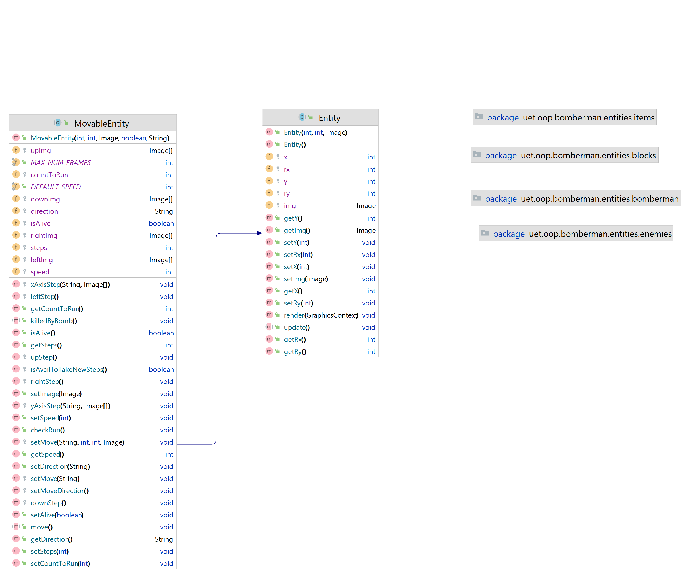

<!-- PROJECT LOGO -->
 

  
<h3 align="center">BOMBERMAN GAME PROJECT</h3>

<!-- ABOUT THE PROJECT -->

## I. Introduction:

### Team Members:

| Order |         Name          |     ID      |            Email            |                       Github account                                                     |
| :---: | :-------------------: | :---------: | :-------------------------: | :---------------------------------------------------------: |
|   1   | Cao Xuan Dung         | 21020290    |   21020290@vnu.edu.vn       |          [caodung27](https://github.com/caodung27)          | 
    

<!-- Game -->
 

## II. Game:
### Description

-  *Bomber* is the main character of the game. Bomber can move in 4 directions left / right / up / down according to the control of the player. 

-  *Bomb* is the object that Bomber will place. Once placed, Bomber cannot move into Bomb position. However, as soon as the Bomber has placed and activated the Bomb at his position, the Bomber can once go from the location where the Bomb is placed to the next position. After activating for 2.5s, Bomb will explode by itself.

-  *Wall* is a fixed object, cannot be destroyed by Bomb and cannot be placed on Bomb, Bomber cannot move on this object.

-  *Brick* is an object that does not allow Bomb to be placed but can be destroyed by Bombs placed nearby. Bomber cannot move into Brick until it is destroyed.

-  *Portal* is the object hidden behind a Brick object. When that Brick is destroyed, the Portal will appear and if all Enemys have been destroyed the player can move to another Level by moving into the Portal's location.

-   *Grass* is an object that does allow Bomb to the placed, Bomber can move on this object.

*Item* is also hidden behind the Brick and only shows up when the Brick is destroyed. Bomber can use Item by moving into Item's position. Information about the function of the Item is listed as follows:
-  *SpeedItem* This item will increase Bomber's movement speed.

-  *FlameItem* This item increases the Bomb's range when it explodes.

-  *BombItem* This item increases the number of Bombs that can be placed by one.

-  *BombLimitItem* This item increases the number of limited bombs.

-  *TimeLimitItem* This item increases the number of limited times.

*Enemy* are the objects that the Bomber must destroy in order to pass the Level. Enemy can move randomly or chase Bomber on its own depending on the type of Enemy. Types of Enemy will be described in detail below:

-  *Ballom* is the simplest Enemy, moving randomly at a slow speed.

-  *Oneal* knows how to chase Bomber when approaching.

-  *Kondoria* is the Enemy that can eat bombs and move around the map without being blocked by anything.

-  *Minvo* is the most complex enemy that can dodge bombs and blocks. It can also knows how to chase Bomber when approaching.
 

## III. UML Class Diagram:

    <h3>1. entities</h3>
    

        
    

    <h3>2. blocks</h3>
    

        
    

    <h3>3. bomberman</h3>
    

        
    

    <h3>4. enemies</h3>
    

        
    

    <h3>5. items</h3>
    

        
    

    <h3>6. graphics</h3>
    

        
    

	<h3>7. level</h3>
    

        
    

	<h3>8. Menu </h3>
    

        
    

	<h3>9. pathFinding</h3>
    

        
    

	<h3>10. sound</h3>
    

        
    

 

## IV. Summation:

We would like to express our gratitude to our teacher for giving us the opportunity to participate in this project
and put what we have learned in theory into practice. This project took a lot of work and time, but it was well worth it 
for all of us. We learned more about interface technologies to build an application that works with our project. 
We will make sure that all that we have learned is not wasted and we can master it better now.

 
	

        
    

 

(<a href="#top">Back to top</a>)

